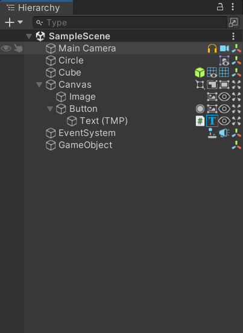

# Custom Hierarchy

## 작성동기
어느 오브젝트에 스크립트가 붙었는지, 살펴보는 시간이 킹받아서 제작하였음.
#### #노안이슈 #손떨림이슈  #그냥 Aging이슈

## 기능
gameObject에 붙은 컴포넌트 Icon들을 나열함.

## 사용 주의사항
Editor 폴더안에 스크립트를 둘것.
빌트인 아이콘이 아닌 아이콘을 사용하려면, Editor Default Resources 폴더를 활용할것.

## 활용 아이디어들
1.  특정 컴포넌트들만 Icon나열한다.
- ex) 컴포넌트가 많이 붙은상태일때, 보기가 힘듬.

2. 컴포넌트에 노출되는 프로퍼티가 None일때, Icon색상을 Red로 세팅한다.
- ex) Image 컴포넌트의 sprite가 None이거나, Text의 font가 None이거나, 

3. Graphic를 상속받는 컴포넌트들의 raycast target값이 true,false에 따라, Icon색상을 세팅한다.

